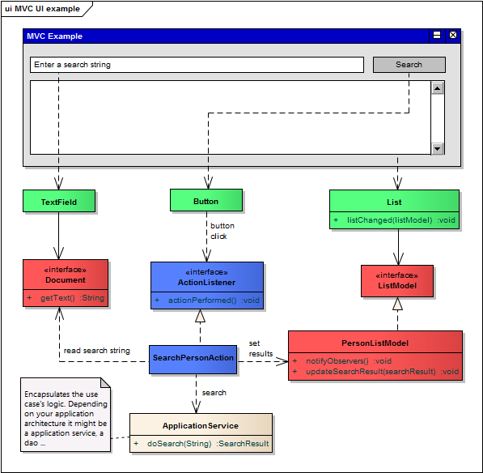

# Swing MVC Example

Taken from this post
https://stackoverflow.com/questions/5217611/the-mvc-pattern-and-swing

specifically this answer:
https://stackoverflow.com/a/17781394/2175739

The MVC pattern is a model of how a user interface can be structured. Therefore it defines the 3 elements Model, View, Controller:

*   **Model** A model is an abstraction of something that is presented to the user. In swing you have a differentiation of gui models and data models. GUI models abstract the state of a ui component like [ButtonModel](http://docs.oracle.com/javase/7/docs/api/javax/swing/ButtonModel.html). Data models abstract structured data that the ui presents to the user like [TableModel](http://docs.oracle.com/javase/7/docs/api/javax/swing/table/TableModel.html).
*   **View** The view is a ui component that is responsible for presenting data to the user. Thus it is responsible for all ui dependent issues like layout, drawing, etc. E.g. [JTable](http://docs.oracle.com/javase/7/docs/api/javax/swing/JTable.html).
*   **Controller** A controller encapsulates the application code that is executed in order to an user interaction (mouse motion, mouse click, key press, etc.). Controllers might need input for their execution and they produce output. They read their input from models and update models as result of the execution. They might also restructure the ui (e.g. replace ui components or show a complete new view). However they must not know about the ui compoenents, because you can encapsulate the restructuring in a separate interface that the controller only invokes. In swing a controller is normally implemented by an [ActionListener](http://docs.oracle.com/javase/7/docs/api/java/awt/event/ActionListener.html) or [Action](http://docs.oracle.com/javase/7/docs/api/javax/swing/Action.html).

**Example**

*   Red = model
*   Green = view
*   Blue = controller

When the `Button` is clicked it invokes the `ActionListener`. The `ActionListener` only depends on other models. It uses some models as it's input and others as it's result or output. It's like method arguments and return values. The models notify the ui when they get updated. So there is no need for the controller logic to know the ui component. The model objects don't know the ui. The notification is done by an observer pattern. Thus the model objects only know that there is someone who wants to get notified if the model changes.

In java swing there are some components that implement a model and controller as well. E.g. the [javax.swing.Action](http://docs.oracle.com/javase/7/docs/api/javax/swing/Action.html). It implements a ui model (properties: enablement, small icon, name, etc.) and is a controller because it extends [ActionListener](http://docs.oracle.com/javase/7/docs/api/java/awt/event/ActionListener.html).

A **detailed explanation, example application and source code**: [https://www.link-intersystems.com/blog/2013/07/20/the-mvc-pattern-implemented-with-java-swing/](https://www.link-intersystems.com/blog/2013/07/20/the-mvc-pattern-implemented-with-java-swing/).

See code locally in the package swing.mvc.example (class: java/swing/mvc/example/SwingMVCExample.java)

